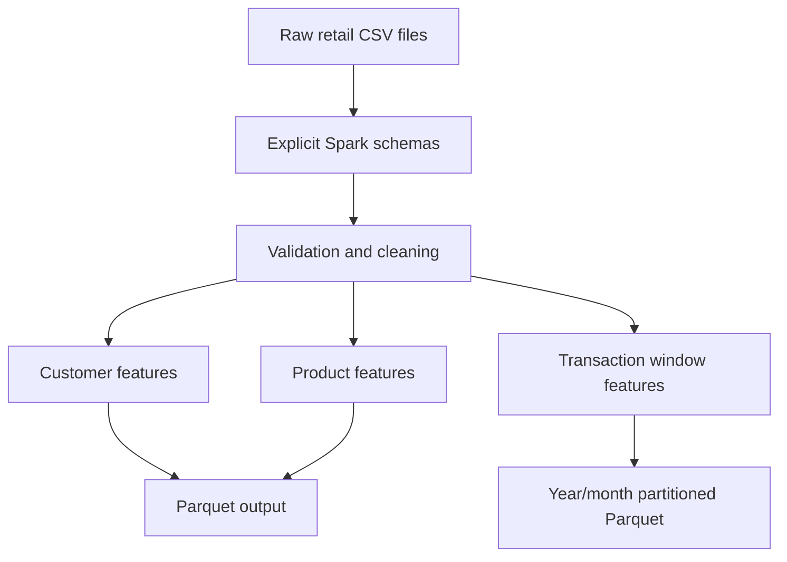

# PySpark Retail Feature Pipeline


A production-style PySpark ETL pipeline that converts large retail datasets into validated, ML-ready customer, product, and transaction feature tables.

The project is designed around the H&M Personalized Fashion Recommendations dataset, which contains more than 3 GB of transaction data.

## Business problem

Retail recommendation systems require reliable customer behavior and product performance features. Raw transaction files contain duplicates, invalid values, missing customer attributes, and unstructured product information.

This pipeline performs the following operations:

1. Extracts customer, product, and transaction data using explicit schemas.
2. Validates and cleans the raw records.
3. Generates customer and product aggregates.
4. Uses Spark window functions to build sequential purchase features.
5. Stores the results as compressed, partitioned Parquet datasets.
6. Runs automated tests through GitHub Actions.

## Pipeline architecture



## Generated features

### Customer features

- Transaction count
- Number of unique articles purchased
- Total spending
- Average transaction price
- First and last purchase dates
- Purchase-history duration
- Channel-specific transaction counts
- Channel usage ratio
- Customer demographic and membership attributes

### Product features

- Total purchase count
- Number of unique customers
- Average selling price
- Total revenue
- First and last purchase dates
- Product type, color, department, section, and garment group

### Transaction features

- Customer purchase sequence number
- Previous purchase date
- Days since previous purchase
- Year and month output partitions

## Data-quality rules

The transformation layer:

- Removes duplicate transactions
- Rejects negative and zero prices
- Rejects invalid sales channels
- Parses transaction dates
- Rejects unrealistic customer ages
- Standardizes fashion-news categories
- Handles missing customer and product attributes
- Removes records with missing entity identifiers

## Technology

- Python
- PySpark
- Spark SQL and DataFrames
- Spark window functions
- Parquet with Snappy compression
- Pytest
- GitHub Actions
- Java

## Project structure

```text
pyspark_retail_feature_pipeline/
├── .github/
│   └── workflows/
│       └── tests.yml
├── data/
│   └── sample/
├── output/
├── sql/
│   └── validation_queries.sql
├── src/
│   ├── config.py
│   ├── schemas.py
│   ├── extract.py
│   ├── transform.py
│   ├── features.py
│   ├── load.py
│   └── pipeline.py
├── tests/
│   ├── conftest.py
│   └── test_transform.py
├── .env.example
├── .gitignore
├── requirements.txt
└── README.md
```

## Local setup

Clone the repository:

```bash
git clone git@github.com:b-amit11/pyspark_retail_feature_pipeline.git
cd pyspark_retail_feature_pipeline
```

Create and activate a virtual environment:

```bash
python3 -m venv .venv
source .venv/bin/activate
```

Install the dependencies:

```bash
python -m pip install -r requirements.txt
```

Create the local configuration:

```bash
cp .env.example .env
```

## Run the sample pipeline

```bash
python -m src.pipeline
```

The generated feature tables are written to:

```text
output/customer_features/
output/product_features/
output/transaction_features/
```

## Run the tests

```bash
python -m pytest -q
```

GitHub Actions also runs the test suite automatically after pushes and pull requests to `main`.

## Dataset

The complete dataset is available through the
[H&M Personalized Fashion Recommendations competition](https://www.kaggle.com/competitions/h-and-m-personalized-fashion-recommendations/data).

The complete dataset is not stored in this repository. Small synthetic CSV files are included for local testing.

## Distributed-computing note

Local development uses Spark in `local[*]` mode. This exercises Spark DataFrames, lazy evaluation, query planning, partitioning, shuffles, and window operations on one machine.

The same pipeline can be configured for a multi-node Spark environment by changing the Spark master and storage paths. Local execution is not represented as production cluster experience.